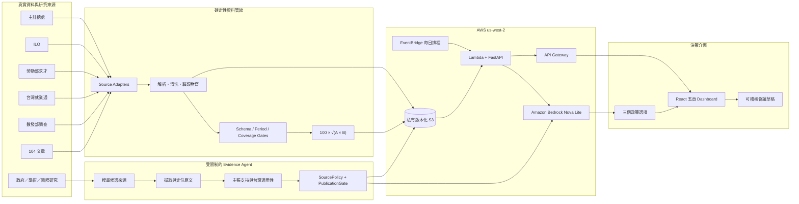

# YouthCHPION / rescueBill

**以可追溯資料與權威證據，協助青年政策幕僚判斷 AI 轉型下哪些職業值得優先介入。**

YouthCHPION 不是涵蓋所有政策的通用圖表平台，而是聚焦「台灣青年初階就業 × AI 轉型」的決策支援 MVP。系統將六個真實來源轉成同一職業分類，公開清洗前後紀錄與資料血緣，再由受限制的 Evidence Agent 核對研究原文，最後交由 Amazon Bedrock 產生三個可比較、附證據與限制的政策選項。

核心閉環：

```text
真實來源更新 → 清洗／對齊 → 透明指標 → 權威證據核證 →
台灣適用性判斷 → 三個政策選項 → 可稽核會議草稿
```

完整規格見 [`docs/DEVELOPMENT_SPEC.md`](docs/DEVELOPMENT_SPEC.md)。

## Live demo

- Dashboard: <https://trzx7426g1.execute-api.us-west-2.amazonaws.com>
- Readiness: <https://trzx7426g1.execute-api.us-west-2.amazonaws.com/ready>
- 精確 18–35 歲資料需使用受授權個體資料；啟用方式見 [`docs/EXACT_18_35_SETUP.md`](docs/EXACT_18_35_SETUP.md)。

若部署環境尚未提供受授權個體資料，API 會明確退回公開年報可直接觀測的 20–24 歲，不會用比例假切 18、19 或 35 歲。

部署在 AWS `us-west-2`。Dashboard API 與前端對外提供 Demo；raw、normalized、published snapshots 均保存在封鎖公開存取且啟用版本控制的私有 S3 bucket。

## 評審可在 90 秒看到什麼

1. 按「重新抓取資料」，建立新的 analysis run，而不是讀取前端 fixture。
2. 查看六來源的取得時間、資料期間、SHA-256、實際欄位、清洗規則與限制。
3. 比較七大職業的政策關注指數、官方求才弱化與 AI 初階機會。
4. 讓 Evidence Agent 即時搜尋並核對最多三筆權威研究，區分台灣直接證據與國際移轉證據。
5. 通過證據閘門後，由 Bedrock 生成剛好三個政策選項及 KPI、風險、限制。
6. 勾選方案並組成會議草稿；這一步是確定性整理，不再次生成內容，因此同一快照可重現與稽核。

## 系統架構



### AI 與非 AI 的責任邊界

| 階段 | 是否使用 AI | 可驗證控制 |
| --- | --- | --- |
| 資料擷取、清洗、職類對齊、指標計算 | 否 | 固定 parser、schema、期間與 coverage gate；相同輸入得到相同輸出 |
| Evidence Agent 搜尋與主張核對 | 是 | 只能按階段呼叫核准工具；來源白名單與 PublicationGate 不能被模型覆寫 |
| 政策選項生成 | 是 | 僅接受最新版 analysis run、已核證 evidence receipt；Pydantic 強制剛好三個選項 |
| 會議草稿整理／重新整理草稿 | 否 | 對目前快照與人工勾選方案做確定性組裝，不重新呼叫 AI |

這個邊界避免把資料清洗或公式包裝成 AI，也避免模型自行更換數據、引用未核證來源或在重新整理文件時悄悄改寫政策。

## Local development

Backend:

```powershell
cd backend
uv sync --all-extras
uv run uvicorn app.main:app --reload --port 8000
```

Frontend:

```powershell
cd frontend
npm install
npm run dev
```

預設前端開發伺服器會將 `/v1` 代理到 `http://127.0.0.1:8000`。

## 目前可用流程

- 真實下載主計總處表 47，以 20–24 歲作主要政策分析，25–29 歲只保留為獨立比較組，並將千人統一為人數。
- 真實下載 ILO 2025 生成式 AI 職業暴露資料，彙整至職業大類。
- 真實查詢台灣就業通，修復非標準 XML、去重、排除過期職缺、辨識初階與 AI 技能需求並執行職業 crosswalk。
- 真實下載勞動部 2013–2025 職業求才序列，計算獨立於 AI 職缺占比的招募弱化與門檻敏感度。
- 從數發部官方目錄自動發現最新數位近用調查，解析 PDF 的 20–29 歲工作自動化主觀感受並跨表校驗。
- 真實查詢 104 官方文章、OpenAlex 與 Crossref。
- 每次更新保存 raw/normalized snapshot、SHA-256、HTTP 狀態、筆數、時間與清洗稽核。
- Bedrock 只接收已發布指標與勾選證據，模型未設定或失敗時不顯示假答案。

## 技術亮點

### 1. 真實更新，不以 fixture 冒充 production

`POST /v1/refresh` 建立唯一 `run_id`，由 Lambda 平行執行來源 adapters。每個來源都保存取得時間、資料期間、內容雜湊與正規化結果；同一來源重抓後以 SHA-256 判斷 `LIVE` 或 `UNCHANGED`。每日 EventBridge 排程也使用同一條 pipeline，因此 Demo 的手動更新與正式定期更新不存在兩套邏輯。

### 2. 跨來源清洗，而不是只把 API 結果畫成圖

不同資料在輸入層維持各自語意，再統一到七大職業分類：Excel 年齡欄、ILO 細職業、台灣就業通官方職類、九大職業歷史求才與 PDF 調查表，不直接互相相加。每個職業指標另外保存 `source_snapshot_refs`，包含 snapshot key、資料期與 SHA-256，可從前端數值追溯到單次 analysis run 的來源版本。

### 3. Fail-closed 發布策略

- 主計總處或 ILO 必要來源失敗時，該 run 不發布新 Dashboard。
- `/ready` 同時檢查 Dashboard 新鮮度、必要來源、官方資料期間、七職類指標完整度及 AI 職缺 crosswalk coverage。
- 過期 Dashboard 會標示 `STALE`，不把舊資料偽裝成最新資料。
- 缺少精確 18–35 個體資料時，系統退回 20–24 公開統計並公開揭露，不用比例補值。
- Bedrock 不可用、回傳不符合 schema 或證據 receipt 不完整時，API 回傳錯誤，不降級成固定政策文案。

### 4. 可重現與可稽核

S3 依 `raw/{run_id}`、`normalized/{run_id}`、`published/{run_id}` 分層保存；公開 Dashboard 有版本化 URL 與 ETag。政策輸出綁定 analysis run、職業、verification id 與 evidence ids，避免資料更新後仍沿用舊證據或舊政策結論。

## 青年 AI 轉型政策關注指數

Dashboard 顯示的 0–100 分不是失業率、失業機率或 AI 取代率，而是相同資料版本內的實驗性政策排序：

```text
A = 該職業青年就業人數 ÷ 該職業全部就業人數
B = ILO 生成式 AI 職務暴露 proxy（0–1）

政策關注指數 = 100 × √(A × B)
```

使用幾何平均可避免單一構面很高時完全支配結果；只有青年集中與 AI 任務暴露同時較高，分數才會明顯上升。這個公式由團隊定義並以 `score_version` 版本化，目前尚未用歷史結果回測校準。

其他訊號不混入分數：

| 訊號 | 定義 | 在決策中的角色 |
| --- | --- | --- |
| P | 該職業占全部青年就業的比率 | 顯示政策可能影響的青年規模 |
| H | 勞動部官方求才年減形成的招募弱化訊號 | 驗證市場是否同步轉弱；不能直接歸因於 AI |
| D | 台灣就業通 AI 相關初階職缺占比 | 區分「需要轉訓」與「已有機會、需要媒合」 |
| 公眾感受 | 數發部版本化調查 | 呈現青年主觀擔憂，不冒充客觀風險 |

原規劃的 C「台灣產業 AI 導入程度」已從計分模型移除。現有產業調查的定義、樣本與產業到職業映射不足以支撐職業層級實值，因此只保留為研究背景。104 文章也只作民間趨勢脈絡，不作量化分數。

政策判讀方式：高關注指數搭配低 D 時優先研究技能培訓與職務轉型；高關注指數搭配高 D 時優先研究技能銜接與就業媒合。所有政策方案仍須通過權威證據 Agent 的來源、原文與台灣適用性閘門。

## 資料來源與清洗

| 來源 | 真實輸入 | 主要處理 | 用途 |
| --- | --- | --- | --- |
| 主計總處表 47 | 官方年度 Excel | 驗證欄位、以 20–24 為主分析、25–29 另列比較、千人轉人數、統一七大職業 | 20–24 歲就業人數與職業集中度 |
| ILO 2025 GenAI Exposure | 官方研究所附 426 筆 CSV | 解析分數與梯度、依 ISCO 職業大類彙整 | 職業 AI 暴露訊號 |
| 台灣就業通 | 勞動部即時公開職缺 XML | 修復非標準 XML、去重、排除過期、辨識初階與 AI 關鍵字、職類 crosswalk | 初階職缺與 AI 機會 |
| 104 職場力 | 官方 WordPress API | 查詢 AI 職缺文章、取得前三篇 metadata、HTML 轉純文字 | 民間產業趨勢脈絡；不進政策關注指數 |
| 勞動部職業求才 | 官方 2013–2025 JSON | 九類先加總分子／分母後合併為七類、年增率、三年變化、10/20/30% 敏感度 | 獨立 H 招募弱化訊號 |
| 數發部數位近用調查 | 最新年度官方頁與 PDF | 自動發現年度、解析表 8-4、以表 8-2 交叉校驗、保留年度序列 | 青年主觀感受；不進政策關注指數 |

Dashboard 的每張來源卡可展開查看本次 HTTP 狀態、SHA-256、實際使用欄位、使用理由、逐步處理規則、限制與可閱讀的官方來源頁。UI 不連到下載檔或機器 API；原始快照只保存在私有 S3 供稽核。`LIVE` 表示本次重新查詢後內容有變動，或是第一次建立快照；`UNCHANGED` 表示本次也有重新下載與處理，但 SHA-256 與上一個成功版本相同，不是 cache 或 fixture。

清洗紀錄必須按來源、按觀測單位分開解讀：主計總處是「選定職業列 → 20–24 歲職業指標」、ILO 是「細職業觀測 → 職業大類」、台灣就業通是「22 個官方職類查詢 → 去重後有效職缺」、104 是「搜尋命中 → 內容解析」、勞動部歷史求才是「年度九類 → 七類可比趨勢」、數發部調查是「官方 PDF → 一筆青年主觀感受與歷年序列」。這些數字皆由當次 run 產生，但不同單位不得相加成一個總 raw/normalized 筆數；104 的 `5 → 3` 是解析選取，不宣稱為清洗。

## 權威證據 Agent

Evidence Agent 的工作不是自由生成引用，而是執行有界限的研究流程：

```text
discover/search → retrieve → inspect → verify claim support → publication gate
```

- **即時探索**：OpenAlex、Crossref 只作 discovery index；必須繼續取得政府、學術機構、國際組織或核准企業調查的原文，不能把 metadata 當成研究結論。
- **工具階段限制**：搜尋、擷取、文件檢查與主張核對只能在對應 phase 執行；未知工具或越級呼叫直接拒絕。
- **來源政策**：拒絕新聞媒體、私人網路、無方法頁的企業內容與不在權威清單的網域；redirect 後再次驗證最終 URL。
- **核證 receipt**：每個可發布主張都需要原文摘錄、locator、最終 URL、SHA-256、authority basis、限制與取得時間。
- **台灣適用性**：分開判斷台灣問題脈絡、台灣介入成效與國際可移轉證據。只有國際研究時，政策必須標示需台灣在地試辦；不把國外成效直接宣稱為台灣成效。
- **有限預算**：一次核證最多三個來源，保存模型、token、耗時、候選數、拒絕數及 gaps，讓研究流程可觀測。

政策 API 只有在 evidence ids 全部屬於該次核證的 approved set，而且 receipt 欄位完整時才會呼叫 Bedrock。這使「AI 找資料」與「AI 可以引用資料」成為兩個不同權限層級。

## Live data

`POST /v1/refresh` 會建立新的 run，實際查詢外部來源。測試 fixture 只用於自動測試，API 回應會明確標記來源 freshness，絕不將 fixture 冒充為即時資料。

第一次開啟畫面時按「開始更新」。前端不含 KPI fixture，因此後端尚未發布時會顯示明確空白狀態。

## API contract

| Endpoint | 用途 | 主要保護 |
| --- | --- | --- |
| `GET /health` | 程序存活檢查 | 不代表資料可發布 |
| `GET /ready` | 資料、指標、Bedrock 與精確年齡能力檢查 | 分開回報 `ready`、`policy_generation_ready`、`exact_18_35_ready` |
| `POST /v1/refresh` | 建立真實資料更新 run | 回傳 `run_id`，非同步執行 |
| `GET /v1/runs/{run_id}` | 查詢更新狀態與各來源結果 | 顯示 `QUEUED` 至 `SUCCEEDED/PARTIAL/FAILED` |
| `GET /v1/dashboard` | 最新已發布 Dashboard | ETag、stale 判斷與 cache policy |
| `GET /v1/dashboard/{run_id}` | 讀取特定版本 | 驗證 URL run id 與內容 run id 一致 |
| `POST /v1/evidence/search` | 即時搜尋研究候選 | 候選仍不可直接作政策證據 |
| `POST /v1/evidence/verify` | Evidence Agent 原文核證 | 必須綁定最新版 analysis run |
| `POST /v1/policy-options` | 產生三個政策選項 | 只接受已核證 evidence receipts |

## Bedrock

只在目前 PowerShell process 設定憑證，不要寫入檔案。至少設定：

```powershell
$Env:AWS_DEFAULT_REGION="us-west-2"
$Env:BEDROCK_MODEL_ID="競賽帳號已開通的 model id"
```

`GET /ready` 會列出模型設定狀態。Evidence Agent 與政策服務使用 Bedrock Converse API；呼叫間隔設為至少 1,100 ms，以符合競賽環境低於每秒一次的限制。模型輸出必須通過資料契約；不合規結果會有限次修復，仍不合規就 fail closed。

## Secrets

AWS credentials 只能由執行環境提供，不得提交至 repository。請複製 `.env.example` 的非敏感欄位說明，自行在 shell 設定臨時憑證。

先前貼在對話中的 STS credential 應視為已暴露；正式部署請換發新的短期 credential，repo 內不保存任何 key。

## 前端交接

- API types：`frontend/src/types.ts`
- API client：`frontend/src/api.ts`
- Dashboard shell：`frontend/src/App.tsx`
- 五頁決策閱讀：`frontend/src/FolderPages.tsx`
- 證據與政策流程：`frontend/src/DecisionPanels.tsx`
- 資料到決策 view model：`frontend/src/decisionModel.ts`
- 視覺 tokens 與 responsive rules：`frontend/src/styles.css`、`frontend/src/folderDashboard.css`

前端不重新計算後端指標，只依 API contract 呈現數值、狀態、資料限制與來源。UI/UX 隊友可修改 tokens 與元件排版，但不應在瀏覽器補造缺值、覆寫年齡範圍或移除 freshness／lineage 狀態。

## AWS deployment

`infra/template.yaml` 是完整的 SAM/CloudFormation 定義。部署時先將 Python 3.13 Linux bundle 建到 template 的 `CodeUri`，再執行 `aws cloudformation package` 與 `aws cloudformation deploy`。目前 competition stack 名稱為 `youthchpion-demo`；執行環境透過 CloudFormation 注入 bucket、region 與 Bedrock model id，不需也不得將 AWS key 寫入專案。

| AWS 元件 | 責任 |
| --- | --- |
| API Gateway HTTP API | 對外提供前端、health/readiness 與版本化 REST API |
| Lambda | FastAPI、資料更新 orchestration、Evidence Agent 與政策生成入口 |
| EventBridge | 每日觸發與手動更新相同的 ingestion pipeline |
| S3 | 私有、加密、版本化保存 raw／normalized／published／evidence artifacts |
| Bedrock Nova Lite | 有界限的研究核對與結構化政策選項生成 |
| CloudFormation / SAM | 將權限、環境變數、排程與資源定義版本化 |

## 驗證策略

```powershell
cd backend
uv run ruff check .
uv run pytest -q

cd ../frontend
npm run check
```

測試覆蓋重點包括：

- 18、35 歲納入且 17、36 歲排除的個體資料邊界測試。
- 主計總處年度發現、表格 schema 與總數檢查。
- 台灣就業通 XML 修復、去重、AI 技能分類與職業 mapping coverage。
- A、B、H、D 與政策關注指數的正常、缺值及舊 snapshot 相容情境。
- Evidence Agent tool phase、SourcePolicy、PublicationGate、receipt 與台灣適用性判斷。
- 最新 analysis run、verification id 與 evidence ids 不一致時的 API 拒絕路徑。
- 五頁切換、職業切換、缺資料狀態、政策選取、會議草稿及 production build。

自動測試是 CI 品質閘門，不等於真實外部服務驗收；部署後仍需完成一次六來源 refresh、Evidence Agent 核證、Bedrock 三方案生成與瀏覽器 smoke test。

## 已知限制與誠實宣告

- 公開主計總處年報只能直接觀測五歲年齡組。目前 production 未配置受授權個體資料，因此主要實測族群仍為 **20–24 歲**；18–35 是政策目標，不是目前線上實測母體。
- ILO B 衡量生成式 AI 任務暴露／轉型潛力，不是失業率或被取代機率。
- H 是官方求才弱化，不能單獨歸因於 AI；D 是平台樣本中的 AI 初階機會率，也不是完整勞動市場普查。
- 政策關注指數尚未以歷史結果回測校準，只能作同版本排序，不能跨版本直接比較或宣稱預測風險。
- 國際介入研究只能補充政策機制；缺少台灣因果成效研究時，方案會標示「需台灣在地試辦驗證」。
- PDF／付費牆或無法取得可定位原文的來源會留下 gap，不使用搜尋摘要補造證據。

## Repository map

```text
backend/app/sources/          # 各來源 adapter 與清洗規則
backend/app/pipeline.py       # run、snapshot、驗證、指標與發布流程
backend/app/evidence_harness/ # Agent contracts、工具、來源政策與發布閘門
backend/app/evidence_agent.py # 權威研究與台灣適用性核對
backend/app/policy.py         # Bedrock 三方案生成與 schema 驗證
frontend/src/                 # 五頁 Dashboard 與決策流程
infra/template.yaml           # AWS SAM / CloudFormation
docs/                         # 開發規格、快取、部署與精確 18–35 設定
openspec/                     # 可追溯產品需求與驗收情境
```
