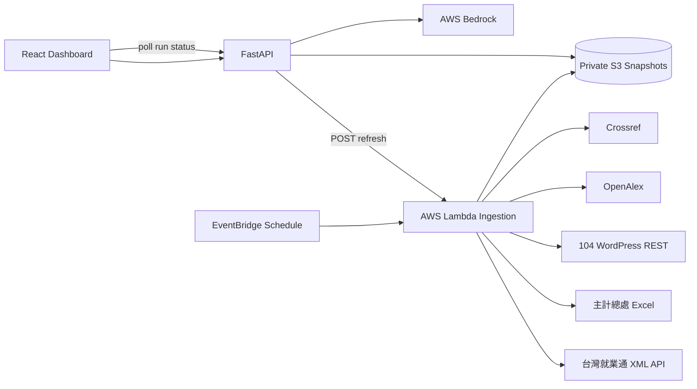

# Youth Champion 青年 AI 就業轉型決策儀表板 — 開發規格書

- 文件狀態：MVP 規格凍結候選版
- 文件日期：2026-09-12
- 目標時限：10 小時內完成可部署、可重跑、可展示的 Demo
- 目標環境：AWS `us-west-2`
- 產品原則：真實查詢、可定期更新、數據可追溯、政策建議可被質疑與查核

## 1. 決策摘要

本產品不是萬能政策分析平台，也不是空白筆記本或視覺化畫布。MVP 只回答一個問題：

> 哪些青年職業正面臨較高的 AI 轉型壓力，政府應優先採取培訓、職務轉型或就業媒合？

Dashboard 固定包含三大區塊：

1. 青年 AI 轉型指標與資料清洗證據。
2. 權威研究、民間資料與公眾調查證據。
3. Bedrock 根據上述資料產生的三個政策選項。

MVP 的正式資料流程必須包含真實外部查詢與排程更新。預先保存的資料只能作為外部服務失敗時的最後成功快照，不得在 UI 上冒充即時資料。

### 1.1 本次必做

- 真實查詢台灣就業通公開職缺 API。
- 真實下載行政院主計總處人力資源調查表。
- 真實查詢 104 公開文章搜尋與文章內容端點，補充民間市場訊號。
- 真實查詢 OpenAlex／Crossref，取得最新研究中繼資料與 DOI。
- 建立 ILO 職業 AI 暴露資料的版本化來源。
- 建立 EventBridge 排程，定期執行同一套資料管線。
- Dashboard 顯示每個來源的查詢時間、資料時間、筆數、內容雜湊與 `LIVE/CACHED/VERSIONED/FAILED` 狀態。
- Bedrock 只能根據已取得的數據與證據產生政策選項，不能發明數字或來源。
- 外部來源失敗時，保留最近成功快照並明確顯示資料已過期。

### 1.2 本次不做

- 登入、帳號、權限管理。
- 空白筆記本、白板、拖曳連線、任意資料上傳。
- 多政策議題切換。
- Dcard／PTT 留言爬取與情緒分析。
- 向量資料庫、複雜 RAG、多 Agent 或 AgentCore 編排。
- 地圖、PDF、PPTX、DOCX 匯出。
- 將不同母體的數字硬乘成 `A × B × C × D`。
- 由 LLM 執行關鍵統計計算或自動補造缺失值。

## 2. 使用者與核心流程

### 2.1 主要使用者

- 青年政策幕僚。
- 勞動與人才培育政策規劃者。
- 需要向主管、民代或審計單位說明政策依據的人員。

### 2.2 主要使用流程

1. 使用者開啟 Dashboard，直接看到最新資料狀態與青年 AI 轉型重點。
2. 使用者按下「立即更新資料」。
3. 前端顯示本次執行的各來源查詢、取得筆數、清洗筆數與成功／失敗狀態。
4. 管線完成後，Dashboard 讀取新發布的 `analysis_result`。
5. 使用者選擇一個職業分類，查看青年就業、AI 暴露、AI 初階職缺與民意訊號。
6. 系統即時檢索相關權威研究與民間報告，顯示研究方法、限制與原始連結。
7. 使用者按下「產生政策選項」。
8. Bedrock 回傳三個附證據編號、限制與 KPI 的政策選項。

## 3. Demo 成功定義

以下條件全部成立才算 Demo 成功：

- 使用者可從 UI 觸發一個新的 refresh run。
- 本次 run 至少有台灣就業通與 104 兩個來源為 `LIVE`，而不是讀取 bundled fixture。
- 主計總處下載端點成功取得真實 Excel，或清楚顯示本次未變更並沿用相同內容雜湊。
- UI 顯示新的 `retrieved_at`、run ID、來源狀態與筆數。
- 清洗頁可展示 raw 與 normalized 資料差異。
- 每一個指標都能回溯到來源 snapshot 與 transformation version。
- Bedrock 回傳三個政策選項，且每項至少引用一筆存在於本次 evidence set 的證據。
- 關閉 Bedrock 或外部來源時，畫面不崩潰，並顯示 `CACHED`／`STALE` 或清楚的錯誤狀態。
- 自動測試、型別檢查與 production build 通過。

## 4. 技術架構



### 4.1 技術選型

| 元件 | 選型 | 原因 |
|---|---|---|
| 前端 | React、TypeScript、Vite | 隊友可平行開發、快速建立固定 Dashboard |
| 後端 | Python 3.12、FastAPI、Pydantic v2 | 適合 API、資料清洗與 OpenAPI contract |
| 外部 HTTP | `httpx` | timeout、retry、async 支援完整 |
| Excel 清洗 | `pandas`、`openpyxl` | 可解析政府統計寬表 |
| AWS | boto3 | Lambda、S3、Bedrock 操作 |
| 儲存 | 私有 S3 | 保存不可變 raw/normalized snapshot 與最新發布指標 |
| 排程 | EventBridge → Lambda | 實際定期更新，並與手動更新共用同一入口 |
| 模型 | Bedrock Converse API | 模型 ID 由環境變數設定，不硬編碼 |
| 測試 | pytest、Vitest、Playwright smoke | 控制資料、API 與關鍵 UI 風險 |

### 4.2 建議目錄

```text
youthchpion/
├─ backend/
│  ├─ app/
│  │  ├─ api/
│  │  ├─ ingestion/
│  │  │  ├─ adapters/
│  │  │  ├─ cleaning/
│  │  │  └─ pipeline.py
│  │  ├─ indicators/
│  │  ├─ evidence/
│  │  ├─ policy/
│  │  ├─ storage/
│  │  └─ main.py
│  └─ tests/
├─ frontend/
│  ├─ src/
│  │  ├─ api/
│  │  ├─ components/
│  │  ├─ features/dashboard/
│  │  └─ types/
│  └─ tests/
├─ infra/
│  └─ template.yaml
├─ data/
│  ├─ dictionaries/
│  ├─ crosswalks/
│  └─ fixtures/
├─ docs/
└─ scripts/
```

MVP 使用單一 repository、單一 FastAPI service 與單一 ingestion Lambda，不拆微服務。

## 5. 資料來源與更新策略

### 5.1 資料新鮮度語意

| 狀態 | 定義 | UI 顯示 |
|---|---|---|
| `LIVE` | 本次 run 對來源發出真實請求並成功取得內容 | 綠色「本次即時取得」 |
| `UNCHANGED` | 本次真實請求成功，但內容 hash 與前次相同 | 綠色「已檢查、來源未變更」 |
| `CACHED` | 本次來源失敗，使用最近成功快照 | 黃色「使用快取」與快取時間 |
| `STALE` | 快照超過來源允許的新鮮度 | 橘色警告 |
| `VERSIONED` | 研究資料本來就是特定發布版本 | 藍色版本標籤 |
| `FAILED` | 無可用來源，也無合法快照 | 紅色，該指標不可發布 |

前端不得把 `CACHED` 或 `VERSIONED` 顯示為「即時」。若內容沒有改變，也不得製造假的數值變動。

### 5.2 MVP 來源矩陣

| Source ID | 類型 | 真實端點／來源 | 用途 | 更新方式 | MVP 優先級 |
|---|---|---|---|---|---|
| `dgbas_hr_46` | 官方 | 主計總處人力資源調查表 46 Excel | 青年年齡 × 行業 | 每週檢查、手動可強制 | P0 |
| `dgbas_hr_47` | 官方 | 主計總處人力資源調查表 47 Excel | 青年年齡 × 職業 | 每週檢查、手動可強制 | P0 |
| `taiwanjobs` | 官方 API | 台灣就業通 XML Webservice | 當前職缺、經驗、職業碼、工作內容 | 每 6 小時＋手動 | P0 |
| `ilo_exposure` | 國際研究 | ILO 2025 GenAI occupational exposure | 職業 AI 暴露 | 每月檢查新版本 | P0 |
| `moda_survey` | 官方調查 | 數發部數位近用調查 | 青年主觀 AI／自動化擔憂 | 每月檢查新年度 | P0 |
| `104_public` | 民間即時內容 | 104 WordPress REST API | AI 職缺趨勢、產業與職類市場佐證 | 每日＋手動 | P0 |
| `openalex` | 學術 API | OpenAlex Works API | 即時研究搜尋、引用數與摘要 | 查詢時＋24h cache | P0 |
| `crossref` | 學術 API | Crossref Works API | DOI、作者、期刊與年份驗證 | 查詢時＋24h cache | P0 |
| `mic_ai_adoption` | 產業智庫 | 資策會 MIC 公開調查／新聞 | 企業 AI 導入背景 | 每週檢查 | P1 |
| `wda_training` | 官方 API | 勞動部職訓課程資料 | AI 課程供給 | 每日 | Stretch |

### 5.3 已驗證的真實查詢端點

下列端點於 2026-09-12 進行連線驗證：

```text
台灣就業通
GET https://free.taiwanjobs.gov.tw/webservice_taipei/Webservice.ashx?count=3
結果：HTTP 200，Content-Type: text/xml

104 公開文章搜尋
GET https://blog.104.com.tw/wp-json/wp/v2/search?search=AI%20職缺&per_page=5
結果：HTTP 200，回傳文章 ID、標題與 URL

104 公開文章
GET https://blog.104.com.tw/wp-json/wp/v2/posts/{post_id}
結果：HTTP 200，回傳 published、modified、link 與正文

OpenAlex
GET https://api.openalex.org/works?search=generative%20AI%20youth%20employment&per_page=3
結果：HTTP 200

Crossref
GET https://api.crossref.org/works?query=generative%20AI%20youth%20employment&rows=3
結果：status=ok

主計總處表 46
GET https://ws.dgbas.gov.tw/001/Upload/463/relfile/11516/234727/table46.xlsx
結果：HTTP 200，Excel MIME type

主計總處表 47
GET https://ws.dgbas.gov.tw/001/Upload/463/relfile/11516/234727/table47.xlsx
結果：HTTP 200，Excel MIME type
```

固定的 Excel URL 只能作為目前版本的 seed。排程更新必須先讀取主計總處年報索引頁，解析最新年度表 46／47 連結，再下載內容；若頁面結構改變，使用前一成功版本並標記 `CACHED`。

### 5.4 來源使用限制

- 台灣就業通最多回傳 1,000 筆／次。MVP 按選定職業大類分層查詢，並明確標示「台灣就業通平台樣本」，不宣稱為全台所有職缺。
- 104 資料只使用公開 REST 回傳的文章與彙總數據，不登入、不繞過限制、不抓取履歷或個人資料。
- 104 報告可作為市場佐證，不直接替代官方就業統計。
- OpenAlex 與 Crossref 主要提供學術中繼資料。只有取得摘要或可公開讀取內容時，Bedrock 才能摘要研究結論。
- ILO 暴露代表任務可能受 GenAI 影響，不等於工作被取代機率。
- 數發部民調代表主觀感受，不等於客觀暴露。

## 6. 指標設計

### 6.1 分析粒度

MVP 的唯一主要 Join Key 是：

```text
occupation_code × age_group × data_period
```

青年年齡層：

- `20-24`
- `25-29`
- Dashboard 可額外顯示合計 `20-29`

主要職業分類使用台灣職業標準分類，再透過版本化 crosswalk 對應至 ISCO-08。地區與產業資料只作背景，不與職業資料直接相乘。

### 6.2 核心指標

#### A. 青年職業集中度

```text
youth_employment_share
= 某職業 20-29 歲就業人數 / 全部 20-29 歲就業人數
```

來源：主計總處表 47。

#### B. AI 職業暴露分數

```text
ai_exposure_score = ILO occupational exposure score or gradient
```

來源：ILO 版本化研究資料。若只有 gradient，UI 顯示類別，不將 ordinal gradient 偽裝成精確機率。

#### C. 青年 AI 暴露負荷

```text
youth_ai_exposure_load
= youth_employment_share × normalized_ai_exposure_score
```

此為比較用指數，不可標示為「被取代人數」。

#### D. AI 初階機會滲透率

```text
ai_entry_opportunity_rate
= AI 技能初階職缺數 / 該職業全部初階職缺數
```

初階判定：

- 無經驗可。
- 工作經驗一年以下。
- 實習或明確的新鮮人條件。

AI 技能判定由版本化字典執行，至少區分：

- `ai_development`：機器學習、深度學習、LLM、NLP、MLOps 等。
- `ai_application`：生成式 AI 工具、Copilot、Prompt、AI 輔助流程等。

#### E. 公眾感受訊號

展示 20-29 歲自評工作可能被 AI／自動化取代的比例及調查年度。此欄位獨立呈現，不參與客觀指標運算。

#### F. 企業 AI 導入訊號

MIC／其他公開產業調查只在有明確產業、樣本與年度時顯示。若無法映射至相同職業粒度，不納入 `youth_ai_exposure_load`。

### 6.3 政策分流規則

| 青年就業 | AI 暴露 | AI 初階需求 | 優先政策方向 |
|---|---|---|---|
| 高 | 高 | 高 | AI 協作型技能培訓＋有薪實務 |
| 高 | 高 | 低 | 職務再設計＋跨職類轉銜 |
| 低／中 | 低／中 | 高 | 初階職缺與產學媒合 |
| 低 | 低 | 低 | 監測，不列為短期優先 |

高／中／低門檻使用當次資料分布的 percentile，並在 API 回應中提供門檻值，前端不得自行計算。

## 7. 資料擷取與清洗管線

### 7.1 Pipeline 狀態機

```text
QUEUED
→ FETCHING
→ INSPECTING
→ NORMALIZING
→ JOINING
→ VALIDATING
→ PUBLISHING
→ SUCCEEDED | PARTIAL | FAILED
```

每次執行都有 UUID `run_id`。手動更新與排程更新呼叫完全相同的 pipeline，不維護兩套邏輯。

### 7.2 第一階段：Ingestion & Inspection

工具名稱：

- `search_sources`
- `fetch_source`
- `inspect_source`

每個 adapter 必須輸出：

```json
{
  "source_id": "taiwanjobs",
  "retrieved_at": "2026-09-12T02:15:00Z",
  "source_published_at": null,
  "http_status": 200,
  "content_type": "text/xml",
  "content_sha256": "...",
  "raw_row_count": 1000,
  "status": "LIVE",
  "source_url": "https://...",
  "schema_fingerprint": "..."
}
```

檢查項目：

- HTTP status、content type、大小上限。
- 必要欄位是否存在。
- Excel sheet 與 header fingerprint 是否改變。
- 日期格式、數值欄位與單位。
- 內容 hash 是否與上次相同。
- 原始回應完整保存至 private S3。

LLM 可以解釋未知 header，但不得在未驗證時自動改寫正式 mapping。

### 7.3 第二階段：Filtering & Alignment

工具名稱：

- `normalize_age_groups`
- `normalize_occupation_codes`
- `classify_ai_skills`
- `join_datasets`

處理步驟：

1. 將主計總處寬表轉為 tidy rows。
2. 只使用來源原本存在的年齡層，不從 18-65 合計值推算青年數字。
3. 將職業名稱正規化並對應台灣職業碼。
4. 透過版本化 CSV crosswalk 對應 ISCO-08。
5. 對職缺做 whitespace、Unicode、全半形與日期正規化。
6. 以來源 URL、公司、職稱、地點與更新日組合進行 deterministic 去重。
7. 使用版本化字典辨識 AI 技能與初階條件。
8. 保存 unmatched categories，不靜默丟棄。

### 7.4 第三階段：Indexing & Contract Export

工具名稱：

- `query_dataset`
- `validate_metrics`
- `build_analysis_result`

只有 `validate_metrics` 通過後才能更新 `latest.json`。發布動作必須 atomic：先完成整個 run，再切換 latest pointer，避免 Dashboard 讀到半套資料。

### 7.5 資料品質門檻

| Gate | MVP 門檻 | 未通過處理 |
|---|---|---|
| 主計總處必要表 | 表 47 可解析且青年年齡欄存在 | 不發布新分析 |
| 台灣就業通回傳 | 至少 50 筆有效職缺 | 沿用快取並標示 stale |
| 職業 crosswalk coverage | 至少 80% | PARTIAL；顯示 unmatched |
| 指標有限值 | 無 NaN、Infinity、負人數 | FAILED |
| 分母 | 所有 rate 分母大於 0 | 該指標為 null，不補 0 |
| 來源追溯 | 每個指標至少一個 snapshot ID | FAILED |
| evidence citation | ID 與 URL 均存在 | 不允許進入 Bedrock prompt |

門檻是 MVP 的保護線，之後可依真實資料結果調整，但調整必須留下版本與理由。

### 7.6 清洗稽核輸出

```json
{
  "raw_rows": 1000,
  "normalized_rows": 884,
  "duplicates_removed": 71,
  "expired_removed": 23,
  "missing_occupation": 22,
  "crosswalk_coverage": 0.934,
  "unmatched_categories": ["..."],
  "transform_version": "2026-09-12.1"
}
```

前端需顯示至少三筆 before/after 範例與上述完整計數。

## 8. 權威證據即時檢索

### 8.1 來源層級

| 層級 | 來源 | 用途 |
|---|---|---|
| A | ILO、OECD、World Bank、政府調查 | 政策效果與方法核心依據 |
| B | 同行評審論文、OpenAlex/Crossref 可驗證 DOI | 補充近期研究 |
| C | MIC、台經院、104 等智庫／產業資料 | 台灣產業與市場即時脈絡 |
| D | 媒體、論壇 | MVP 不使用 |

### 8.2 `search_sources` 行為

輸入：

```json
{
  "query": "AI exposure youth entry-level employment training",
  "occupation_code": "4",
  "limit": 8,
  "force_live": true
}
```

執行：

1. 查詢 OpenAlex。
2. 查詢 Crossref 並以 DOI 去重及驗證。
3. 查詢 104 公開 WordPress REST，尋找近期 AI 職缺／技能文章。
4. 合併本次已刷新之 ILO、OECD、World Bank、MIC 等 trusted-source snapshots。
5. 依 source tier、相關性、年份、是否有摘要、DOI 與研究方法排序。
6. 保存 query、原始結果、檢索時間與排名理由。

若 live query 失敗，可回傳 24 小時內 cache，但 UI 必須顯示 `CACHED`。

### 8.3 Evidence contract

```json
{
  "evidence_id": "ev_01",
  "title": "The Impact of Active Labour Market Programmes on Youth",
  "institution": "ILO / World Bank",
  "authors": [],
  "published_at": "2026-04-29",
  "evidence_type": "systematic_review",
  "method_summary": "228 studies across 62 countries",
  "finding": "...",
  "policy_relevance": ["skills_training", "employment_services"],
  "limitations": "Cross-country effects vary by programme and population.",
  "doi": "...",
  "url": "https://...",
  "retrieved_at": "2026-09-12T02:20:00Z",
  "freshness": "LIVE"
}
```

系統不得產生「專家一致認為」等無法由 evidence set 支持的文字。不可引用只取得標題、但沒有摘要或內容的論文結論。

### 8.4 外部內容安全

- 所有 fetch URL 由 server-side allowlist 或 adapter 產生，使用者不能指定任意 URL。
- 移除 script、style、iframe、form 與 event handler。
- 限制單篇文件大小、文字長度與 redirect 次數。
- 外部文本一律視為不可信資料，不執行其中指令。
- Bedrock system prompt 明確宣告來源內容不可覆寫系統規則。

## 9. Bedrock 政策生成

### 9.1 職責邊界

Bedrock負責：

- 摘要本次分析。
- 將指標與證據連成政策推論。
- 產生三個政策選項。
- 說明限制與待驗證假設。

Bedrock不負責：

- 計算就業率、比例、排名與 percentile。
- 補造缺失資料。
- 發明專家、文獻、數字、DOI 或 URL。
- 把暴露程度描述成確定失業或取代機率。

### 9.2 Policy request

```json
{
  "analysis_run_id": "run_uuid",
  "occupation_code": "4",
  "policy_goal": "降低青年AI轉型落差",
  "evidence_ids": ["ev_01", "ev_02", "ev_03"]
}
```

### 9.3 Policy response

```json
{
  "generated_at": "2026-09-12T02:30:00Z",
  "model_id": "configured-at-runtime",
  "analysis_run_id": "run_uuid",
  "options": [
    {
      "title": "企業共訓型AI職務轉型計畫",
      "target_group": "...",
      "problem": "...",
      "mechanism": "...",
      "implementation": ["..."],
      "kpis": [
        {"name": "結訓後90日就業率", "target": "pilot-defined"}
      ],
      "evidence_ids": ["ev_01", "ev_03"],
      "risks": ["..."],
      "limitations": ["..."]
    }
  ],
  "warnings": []
}
```

### 9.4 Server-side validation

- `options` 必須剛好三筆。
- 所有 `evidence_ids` 必須存在於送入模型的 evidence set。
- 不允許回應出現 input 中不存在的百分比或人數。
- 找不到足夠證據時，回傳 `insufficient_evidence`，不得生成肯定結論。
- 模型 JSON 解析失敗時只重試一次。
- Bedrock 呼叫由全域 rate limiter 控制為低於 1 request/second。

## 10. 後端 API

Base path：`/v1`

| Method | Path | 功能 |
|---|---|---|
| GET | `/health` | process 存活 |
| GET | `/ready` | S3、Bedrock 基本可用性與 latest snapshot |
| GET | `/dashboard` | 取得最新已發布分析 |
| POST | `/refresh` | 啟動真實資料更新 |
| GET | `/runs/{run_id}` | 查詢更新進度與各來源狀態 |
| GET | `/runs/{run_id}/audit` | 清洗稽核、before/after 與品質 gate |
| GET | `/occupations/{code}` | 單一職業指標與來源 |
| POST | `/evidence/search` | 即時查詢研究與民間資料 |
| POST | `/policy-options` | 呼叫 Bedrock 產生三個政策選項 |

### 10.1 `POST /v1/refresh`

Request：

```json
{
  "force": true,
  "sources": ["dgbas_hr_47", "taiwanjobs", "104_public", "openalex", "crossref"]
}
```

Response `202`：

```json
{
  "run_id": "4f2e...",
  "status": "QUEUED",
  "poll_url": "/v1/runs/4f2e..."
}
```

同時間只允許一個 full refresh。若已有執行中的 run，回傳 `409 refresh_in_progress` 與既有 run ID。

### 10.2 `GET /v1/runs/{run_id}`

```json
{
  "run_id": "4f2e...",
  "trigger": "manual",
  "status": "NORMALIZING",
  "started_at": "2026-09-12T02:15:00Z",
  "finished_at": null,
  "sources": [
    {
      "source_id": "taiwanjobs",
      "status": "LIVE",
      "retrieved_at": "...",
      "raw_rows": 1000,
      "content_sha256": "...",
      "message": null
    }
  ]
}
```

### 10.3 `GET /v1/dashboard`

必要欄位：

```json
{
  "contract_version": "1.0",
  "analysis_run_id": "...",
  "published_at": "...",
  "freshness": {
    "overall": "LIVE",
    "sources": []
  },
  "summary_metrics": {},
  "occupation_signals": [],
  "public_opinion": [],
  "industry_context": [],
  "cleaning_summary": {},
  "evidence_preview": [],
  "policy_options": null
}
```

### 10.4 Error contract

```json
{
  "error": {
    "code": "source_unavailable",
    "message": "TaiwanJobs did not respond within the timeout.",
    "retryable": true,
    "source_id": "taiwanjobs",
    "run_id": "..."
  }
}
```

前端只依 `code` 決定畫面，不比對英文 message。

## 11. S3 儲存格式

Bucket 必須為 private：

```text
raw/{source_id}/{run_id}/payload.{xml|xlsx|json|html}
raw/{source_id}/{run_id}/metadata.json
normalized/{source_id}/{run_id}/data.json
runs/{run_id}/status.json
runs/{run_id}/audit.json
runs/{run_id}/analysis_result.json
evidence/{query_hash}/{retrieved_at}.json
latest/pointer.json
```

`latest/pointer.json`：

```json
{
  "run_id": "...",
  "analysis_key": "runs/.../analysis_result.json",
  "published_at": "..."
}
```

只有完成 validation 的 run 可更新 pointer。raw snapshots 不覆寫，方便審計與重現。

## 12. Frontend UI/UX 規格

前端隊友可以先使用 `/v1/dashboard` fixture 開發，但正式 Demo 必須連到真實 backend。

### 12.1 頁首

- 產品名稱與一句政策問題。
- 「立即更新資料」按鈕。
- 最新發布時間。
- 整體狀態：即時／部分快取／過期。
- 更新中顯示階段與來源進度，不只顯示 spinner。

### 12.2 區塊一：青年 AI 轉型指標

- KPI cards：青年失業背景、青年就業規模、AI 初階需求、公眾感受。
- 青年 AI 轉型矩陣：X=暴露、Y=青年就業占比、氣泡=AI 初階職缺。
- 職業 ranking table。
- 點選職業後顯示三組原始數據與來源 freshness。
- 「資料如何形成」drawer：raw/cleaned before-after、筆數、去重、join coverage、unmatched。

### 12.3 區塊二：權威證據

- 查詢詞預設由選定職業與政策議題產生，使用者可修改短查詢。
- 顯示 live search loading、來源類型與檢索時間。
- 每列顯示機構、研究方法、核心發現、限制、年份與原文連結。
- `LIVE`、`CACHED`、`VERSIONED` badge 必須可見。
- 不顯示無法取得摘要／內容的推論性結論。

### 12.4 區塊三：政策選項

- 「產生政策選項」按鈕在 evidence search 完成後才啟用。
- 顯示三張政策卡：目標族群、機制、執行步驟、KPI、證據、風險與限制。
- 點擊證據編號可捲動至對應證據列。
- Bedrock 失敗時顯示錯誤及「重試」，不把 fixture 冒充真實回答。

### 12.5 必須支援的畫面狀態

- Initial loading。
- Refresh queued/running/succeeded/partial/failed。
- Source live/unchanged/cached/stale/failed。
- Empty metric because denominator unavailable。
- Evidence live search timeout。
- Bedrock unavailable／invalid response。
- Latest snapshot exists but部分來源過期。

### 12.6 前端邊界

- 前端不計算政策指標，只做格式化與視覺化。
- 前端不得把 `null` 顯示為 `0`。
- 所有數字顯示來源日期與 tooltip 定義。
- API type 由 OpenAPI 產生或與 contract fixture 同步。

## 13. 排程與即時更新

### 13.1 EventBridge

MVP 建立一條 EventBridge schedule：每 6 小時觸發 ingestion Lambda。

來源內部會依自己的 cadence 決定是否抓取：

- 台灣就業通：每次排程。
- 104：每天至少一次。
- 主計總處：每週檢查一次；手動 force 可立即查。
- OpenAlex/Crossref：查詢時執行；排程可預熱預設議題。
- ILO、數發部、MIC：每週或每月檢查版本。

### 13.2 手動更新

Dashboard 手動更新以 Lambda async invocation 執行，與 EventBridge 共用 handler。FastAPI 產生 `run_id` 後呼叫 Lambda，UI 以 1–2 秒間隔輪詢狀態。

### 13.3 Demo 證明不是固定資料

更新前顯示上一個 run：

```text
Last run: 2026-09-12 09:00
TaiwanJobs: CACHED
104: CACHED
```

按下更新後顯示：

```text
Run: 4f2e...
TaiwanJobs: LIVE · HTTP 200 · 1,000 rows · retrieved 10:42:13
104: LIVE · 5 articles · latest modified 2026-08-26
DGBAS: UNCHANGED · checked 10:42:15 · same SHA-256
Crossref: LIVE · 8 results
```

即使數字沒有變，新的查詢時間、HTTP 成功、內容 hash 與 run log 已能證明本次有真實查詢；不得刻意修改數值營造變動。

## 14. AWS 部署

### 14.1 元件

- EC2：單一 Docker container，FastAPI 同時提供 API 與 build 後的前端靜態檔。
- S3：private snapshots 與 latest pointer。
- Lambda：資料擷取、清洗、驗證與發布。
- EventBridge：定期觸發 Lambda。
- Bedrock：政策選項生成。
- CloudWatch Logs：API、Lambda 與 Bedrock request metadata。
- IAM：EC2 與 Lambda 使用 role，不在 image 或 repository 放 AWS key。

### 14.2 環境變數

```text
AWS_DEFAULT_REGION=us-west-2
BEDROCK_MODEL_ID=...
DATA_BUCKET=...
INGESTION_FUNCTION_NAME=...
APP_ENV=production
HTTP_TIMEOUT_SECONDS=12
SOURCE_MAX_RETRIES=2
BEDROCK_MIN_INTERVAL_MS=1100
LATEST_MAX_STALE_HOURS=168
```

AWS access key、secret key、session token 不得寫入 `.env.example`、log、snapshot、Docker image 或 Git history。

### 14.3 最小權限

EC2 role：

- 讀取 latest/run/evidence S3 objects。
- 非同步 invoke 指定 ingestion Lambda。
- 呼叫指定 Bedrock model。

Lambda role：

- 寫入指定 bucket prefix。
- 寫入 CloudWatch Logs。

S3 啟用 Block Public Access。Security Group 只開展示所需 port 與來源，不使用全開規則。

## 15. 可靠性與降級

### 15.1 Source adapter

- connect timeout 5 秒、total timeout 12 秒。
- 對 429、502、503、504 最多重試兩次，使用 exponential backoff 與 jitter。
- 不重試 schema validation error。
- 每來源設 circuit breaker，避免連續故障拖垮整個 run。

### 15.2 發布規則

P0 核心資料：主計總處青年職業資料、ILO 暴露資料、台灣就業通職缺。

- 主計總處或 ILO 本次未更新，但有未過期版本：可發布，標記 `VERSIONED/UNCHANGED`。
- 台灣就業通失敗但有未過期快照：可發布 `PARTIAL`。
- 缺少主計總處或 ILO 可用版本：不得發布新指標。
- 104/OpenAlex/Crossref 失敗：指標仍可發布，但 evidence 區明確降級。

### 15.3 Bedrock fallback

- 保留最後一次成功政策結果，只能標示「先前生成」，不得標示本次 AI 回答。
- 無成功結果時顯示服務不可用，不以 fixture 冒充。
- 本機／自動測試可使用 fixture，但 fixture 必須帶 `is_fixture: true`。

## 16. 測試與驗證

### 16.1 Unit tests

- 年齡欄位解析與不合法年齡。
- AI 關鍵字正例、反例與 Unicode 正規化。
- 初階職缺判定。
- 去重規則。
- 台灣職業碼至 ISCO crosswalk。
- 分母為零、缺值與極端值。
- policy citation ID validation。

### 16.2 Contract tests

- `/dashboard` 符合 contract version 1.0。
- refresh/run status 所有 enum 可被前端解析。
- `null` 與 `0` 不混淆。
- Bedrock response 不得包含未知 evidence ID。

### 16.3 Adapter integration tests

- 使用保存的小型合法 response fixture 驗證 parser。
- 另設 manual/live smoke test，實際呼叫台灣就業通、104、OpenAlex、Crossref 與主計總處。
- live smoke test 不作為每次 CI 的硬依賴，避免外部服務使 CI 不穩定；部署前必須執行一次。

### 16.4 End-to-end

至少一條：

```text
打開 Dashboard
→ 觸發 refresh
→ 等待 run succeeded/partial
→ 查看 LIVE source
→ 選擇職業
→ 查詢 evidence
→ 產生三個政策選項
```

### 16.5 發布 Gate

- Python formatter/lint 通過。
- pytest 通過。
- TypeScript typecheck 通過。
- Vitest 通過。
- Vite production build 通過。
- live source smoke 通過。
- Bedrock preflight 通過。
- 人工完整 Demo 一次通過。

## 17. Logging 與可觀測性

所有 log 使用結構化 JSON，包含：

```text
timestamp
level
service
run_id
source_id
stage
duration_ms
row_count
http_status
cache_status
error_code
```

禁止記錄：

- AWS credentials。
- 完整 Bedrock prompt 中可能過長的第三方內容。
- 個人履歷、論壇帳號或不必要的職缺聯絡資訊。

Dashboard 的 run log 只顯示安全摘要，不顯示 stack trace。

## 18. 前後端分工

### 後端／資料負責

- FastAPI contract 與 OpenAPI。
- source adapters、清洗、crosswalk、指標與 audit。
- Lambda、EventBridge、S3 與 Bedrock。
- contract fixture 與錯誤碼。
- backend unit/integration tests。

### 前端 UI/UX 隊友負責

- 三區固定 Dashboard。
- refresh progress 與 freshness badge。
- 指標矩陣、職業 drill-down。
- cleaning audit drawer。
- evidence table 與 policy cards。
- loading/partial/stale/error states。
- frontend typecheck/tests/build。

### 共用交付界線

- 後端先提交 `openapi.json` 與三份 fixture：success、partial、failed。
- 前端只依 contract 開發，禁止依畫面自行猜欄位。
- 合併前共同跑一次真實 refresh 與 Bedrock policy generation。

## 19. 10 小時執行順序

### 0–3 小時：建立真實資料骨架

- 建立 repository skeleton、contracts 與 S3 layout。
- 完成台灣就業通、主計總處與 104 adapters。
- 完成 run status、raw snapshot 與 content hash。
- 前端同步用 contract fixture 開始 Dashboard。

驗收：命令列執行 pipeline，S3／本機產生一個真實 run manifest。

### 3–6 小時：清洗、指標與 Dashboard

- 完成年齡與職業正規化、AI 字典、去重、crosswalk。
- 完成分析指標與 cleaning audit。
- 完成 `/dashboard`、`/refresh`、`/runs/{id}`。
- 前端完成矩陣、資料狀態與 audit drawer。

驗收：UI 觸發真實 refresh，看到 LIVE/UNCHANGED 與 row counts。

### 6–8 小時：Evidence 與 Bedrock

- 完成 OpenAlex、Crossref、104 evidence search。
- 完成 evidence contract 與 ranking。
- 完成 Bedrock prompt、JSON schema 與 citation validation。
- 前端完成 evidence table 與三張政策卡。

驗收：至少一個職業能完成 live evidence search 與真實 Bedrock 回應。

### 8–10 小時：排程、部署與正確性

- 建立 EventBridge → Lambda。
- 部署單一 EC2 container。
- 跑 unit、contract、build、live smoke 與 Bedrock preflight。
- 完成一次 90 秒 Demo 彩排。
- 保存最後成功快照，但確認 UI 可辨識 cache。

驗收：線上環境完成全流程，且外部來源任一失敗時不崩潰。

若時間不足，刪除順序：

1. WDA 課程資料。
2. MIC 自動抓取，改保留手動建立且有來源的 evidence seed。
3. OpenAlex 摘要內容，只留 Crossref DOI 驗證與既有權威來源。
4. 次要職業分類。

不可刪除：真實 refresh、來源 freshness、清洗 audit、三個政策選項、citation validation、錯誤狀態。

## 20. 驗收條件

### 20.1 資料

- [ ] UI 觸發 refresh 後產生全新 run ID。
- [ ] 台灣就業通與 104 在正常網路下顯示 `LIVE`。
- [ ] 主計總處顯示 `LIVE` 或 `UNCHANGED`，並有新 retrieved time。
- [ ] raw response、metadata、normalized data 與 audit 可對應同一 run ID。
- [ ] 每個指標包含 source snapshot IDs。
- [ ] crosswalk coverage 與 unmatched categories 可見。

### 20.2 Evidence

- [ ] Evidence search 至少查詢兩個真實外部 API。
- [ ] DOI、URL、發表時間與 retrieved time 可見。
- [ ] 無摘要／正文時不產生研究結論。
- [ ] 104 明確標記為民間市場來源。
- [ ] 公眾調查明確標記為主觀感受。

### 20.3 Policy

- [ ] Bedrock 回傳剛好三個政策選項。
- [ ] 每項政策包含目標族群、機制、KPI、證據與限制。
- [ ] 每個 evidence ID 均可點回真實來源。
- [ ] 回應不得出現 input 未提供的新數字。
- [ ] Bedrock 失敗時不展示假 AI 成果。

### 20.4 UI 與可靠性

- [ ] Loading、success、partial、stale、failed 均有清楚畫面。
- [ ] `null` 不顯示為 `0`。
- [ ] 外部來源 timeout 不使整頁崩潰。
- [ ] 線上 Demo 可在 90 秒完成主流程。

## 21. 90 秒 Demo 腳本

1. 「我們聚焦一個問題：AI 發展下，哪些青年職業最需要政策介入？」
2. 點擊「立即更新資料」，展示台灣就業通、104、主計總處的真實查詢時間與筆數。
3. 指向青年 AI 轉型矩陣，選擇一個高青年就業、高暴露職業。
4. 展開清洗 audit，展示政府 Excel、XML 職缺與 ISCO 如何被標準化、去重與 Join。
5. 執行權威證據搜尋，展示 ILO／OECD／論文 DOI 與 104 民間市場資料。
6. 呼叫 Bedrock，產生三個政策選項及證據編號。
7. 收尾：「這不是 AI 幫忙畫圖，而是能從即時市場、官方統計、研究證據一路追溯到政策選項的決策系統。」

## 22. 主要風險與處置

| 風險 | 影響 | 處置 |
|---|---|---|
| 外部 API timeout | refresh 失敗 | timeout/retry、per-source status、last good snapshot |
| 104 REST 結構變更 | 民間證據缺失 | schema fingerprint、PARTIAL、不得影響核心指標 |
| 主計總處 Excel header 改版 | 解析錯誤 | schema gate、停止發布、沿用舊版本 |
| 職業 crosswalk 不完整 | 指標偏差 | coverage、unmatched 清單、禁止靜默丟棄 |
| 職缺樣本不代表全市場 | 過度推論 | UI 明示平台樣本、104 只作三角驗證 |
| Bedrock 幻覺 | 錯誤政策依據 | structured input、evidence ID allowlist、server validation |
| 模型或憑證不可用 | Demo 中斷 | preflight、清楚錯誤、先前結果標示為 cached |
| 時間不足 | 功能不完整 | 依 19 節順序刪除 stretch，不刪核心可信鏈 |

## 23. 核心工程觀念：Provenance Chain

本系統最重要的不是「有沒有即時抓資料」，而是每個結果是否能追溯：

```text
source URL
→ retrieved_at + raw SHA-256
→ cleaning transform version
→ normalized rows
→ indicator formula
→ evidence IDs
→ policy option
```

只要其中一段斷掉，政策選項就不具審計防禦力。前端 freshness badge、後端 run manifest、S3 immutable snapshots 與 Bedrock citation validation 都是同一條 provenance chain 的不同呈現。

## 24. 參考來源

- 行政院主計總處 113 年人力資源調查統計：https://www.stat.gov.tw/News_Content.aspx?n=4002&s=234885
- 台灣就業通網站職缺清單：https://data.gov.tw/dataset/44062
- ILO, Generative AI and Jobs: A Refined Global Index of Occupational Exposure：https://www.ilo.org/publications/generative-ai-and-jobs-refined-global-index-occupational-exposure
- ILO / World Bank, The Impact of Active Labour Market Programmes on Youth：https://www.ilo.org/publications/impact-active-labour-market-programmes-youth
- OECD, Artificial intelligence and the changing demand for skills in the labour market：https://www.oecd.org/en/publications/artificial-intelligence-and-the-changing-demand-for-skills-in-the-labour-market_88684e36-en.html
- 104 AI 人才與工作機會資料：https://blog.104.com.tw/104data-aws-ai/
- 資策會 MIC 製造業 AI 導入調查：https://mic.iii.org.tw/news.aspx?List=30&id=710
- 113 年數位近用調查：https://srda.sinica.edu.tw/file/e0362889-6adc-4857-9908-4319f33548a3

