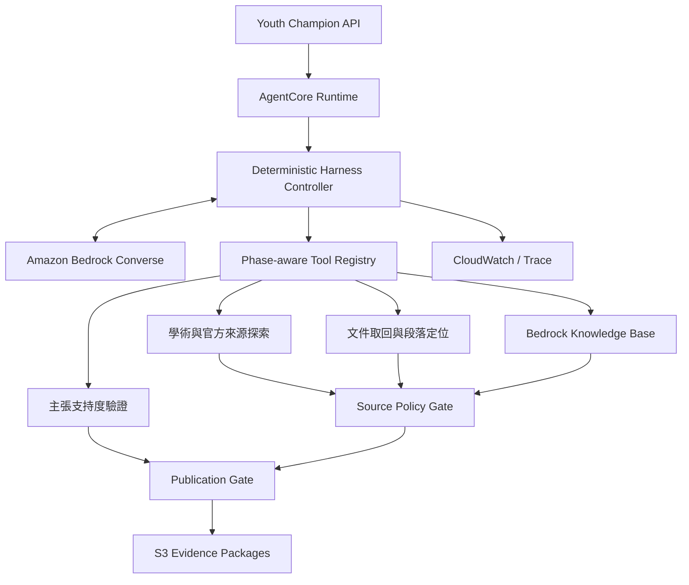
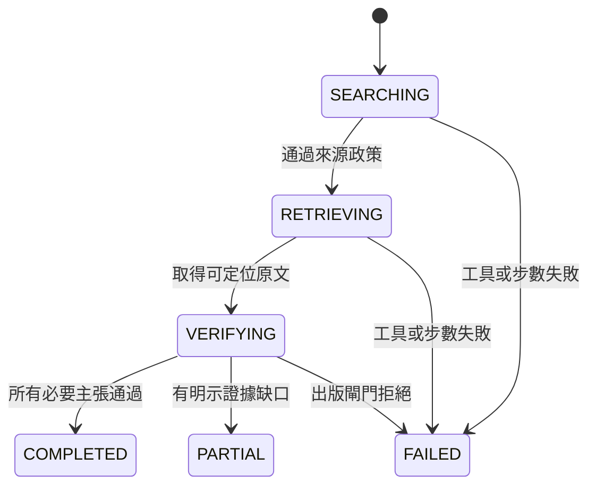

# 權威證據 Agent Harness 架構

## 決策摘要

這個 Harness 只負責「找資料、取回原文、核對主張、封裝證據」，不負責計算就業風險指標，也不直接
產生政策建議。新聞與媒體內容在搜尋、候選收錄及出版三個階段全部禁止，不能作為 discovery lead。

允許的來源擁有者只有：個別學者、政府、國際組織、研究機構，以及有公開方法且經網域核准的企業
調查。搜尋結果摘要與 bibliographic metadata 只能協助定位文件，不能直接支撐主張。

## 目前 competition runtime

`/v1/evidence/verify` 目前在既有 API Lambda 內執行 `AuthorityEvidenceAgent`。production path 使用固定的
discover → retrieve → validate-final-URL → inspect → Bedrock-verify → publication-gate 流程，最多三個
來源、每來源十二段送入模型、總 deadline 90 秒。回應保存 prompt version、來源數、模型呼叫數、token、
耗時、實際取回 URL 與原文 SHA-256。候選來源的 A/B/C tier 只是排序 metadata；只有取得上述 receipt
的 claim 才能在 UI 顯示為「已通過原文認證」，也只有 receipt 欄位完整的 claim 能送入政策生成；
舊版缺少 receipt 的儲存紀錄會 fail closed。

獨立的 `EvidenceHarness` 是 AgentCore topology 的 contract/runtime prototype；它現在也會把最終 package
綁回同一次執行的 discover、retrieve、inspect 與 supported verification observations。它尚未取代 API
Lambda 的 in-process runtime，因此不能把 prototype 測試結果當作 production trace。

## AgentCore 目標架構

來源 Policy Gate 與 Publication Gate 都是確定性程式，不由模型自行判斷是否放行。工具 Lambda 按功能
拆開，讓每個 function 只取得必要的網路出口、API secret 與資料權限；之後需要跨帳號或 MCP 時，
可在 Tool Registry 後改接 AgentCore Gateway，而不改控制器與 Evidence Package contract。

## Harness 狀態機

## 工具分配

| 工具 | 可用階段 | 後端責任 | 不得做的事 |
|---|---|---|---|
| `discover_evidence` | SEARCHING | 查 OpenAlex、Crossref、政府／國際組織官方索引 | 一般網搜、新聞搜尋、把 snippet 當證據 |
| `search_policy_knowledge_base` | SEARCHING | 查已審核並匯入 Bedrock KB 的政策文件 | 查未經審核的公開網頁 |
| `retrieve_candidate` | RETRIEVING | 下載候選全文、保存來源 URL 與雜湊 | 繞過來源政策 |
| `inspect_document` | RETRIEVING、VERIFYING | 擷取段落並記錄頁碼／章節 locator | 只回傳模型摘要 |
| `verify_claim_support` | VERIFYING | 判定 entailment、矛盾與限制，保留 claim-source mapping | 產生新的事實主張 |

去重、網域分級、DOI 正規化、內容 hash、步數限制、來源政策與 publication gate 都是 hidden
operations，不交給模型呼叫。

## 來源政策

| 類型 | 接受條件 | 例子 |
|---|---|---|
| 個別學者 | 原始論文、working paper、官方大學／研究者頁面 | DOI、`.edu`、`.edu.tw` |
| 政府 | 官方報告或統計 | `.gov`、`.gov.tw` |
| 國際組織 | 組織官方出版品 | ILO、OECD、World Bank、UN、EU |
| 研究機構 | 經人工加入 allowlist 的官方網域 | NBER、RAND、中研院 |
| 企業調查 | 網域預先核准，且同網域公開 methodology | 方法透明的人力／技能調查 |
| 新聞／媒體 | **一律拒絕** | 報紙、通訊社、電視新聞、新聞入口網站 |

防線有兩層：`discover_evidence` 的結果先被過濾；模型完成研究後，`PublicationGate` 再逐一驗證
來源、excerpt、locator 與 claim mapping。企業名稱不是信任依據，必須同時通過網域 allowlist 與
methodology 檢查。

## 採用的開源設計模式

- [GPT Researcher](https://github.com/assafelovic/gpt-researcher)：採用 planner／execution／publisher
  的責任切分，但改為單一受控狀態機，降低多 agent 漂移與成本。
- [Open Deep Research](https://github.com/langchain-ai/open_deep_research)：採用可替換模型 provider、
  search tool 與 structured output；不採用 unrestricted web search。
- [PaperQA2](https://github.com/Future-House/paper-qa)：採用以文件片段、metadata awareness 與行內引用
  為中心的 evidence contract。
- [STORM](https://github.com/stanford-oval/storm)：採用先 knowledge curation、再組織輸出的分階段
  概念；本 Harness 停在 Evidence Package，不撰寫百科式文章。

這些專案是架構參考，不是 Youth Champion 的證據來源，因此不違反「新聞來源不要用」的產品規則。

## AWS 部署邊界

1. 將 `backend` 建成 Python 3.12 container，安裝 runtime dependencies，並用
   `deployment/agentcore_app.py` 作入口。
2. AgentCore Runtime role 只需 `bedrock:InvokeModel` 與五個指定 Lambda 的 `lambda:InvokeFunction`。
3. 每個工具 Lambda 使用獨立 role；探索工具的 egress 僅允許核准 API／官方來源。
4. API key 存 Secrets Manager，不放 prompt、環境回傳或 trace。
5. Evidence Package 寫入有 versioning、SSE-KMS 與 lifecycle 的 S3；trace 送 CloudWatch。
6. 用 `EVIDENCE_MAX_STEPS` 設硬上限，Bedrock temperature 固定為 0；逾限直接失敗，不讓模型自行續跑。

## Evidence Package 出版條件

- 每個 evidence item 都要有穩定 URL、來源類型、publisher 與至少一段原文 excerpt。
- excerpt 要有頁碼／章節 locator，且明確綁定 `claim_id`。
- 必要 claim 缺少證據時輸出 `PARTIAL` 與 gap，禁止用常識補齊。
- 來源政策錯誤、excerpt/source 不一致或提前出版，整包拒絕。
- Harness 輸出是可稽核證據，不代表因果結論，也不等同最終指標或政策建議。
